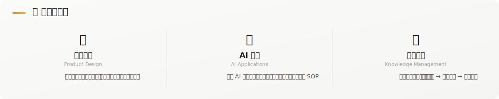
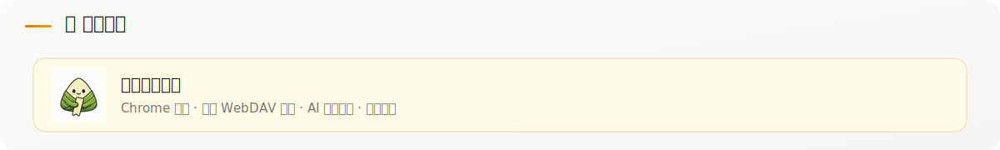

  

  

  

  

  
  

  

  
  &nbsp;
  
  &nbsp;
  

## 🤝 欢迎交流

  📧 <a href="mailto:mr.zongzi666@gmail.com">mr.zongzi666@gmail.com</a>
  &nbsp;&nbsp;·&nbsp;&nbsp;
  💬 公众号：粽子网上冲浪指南

  

  
  
  
  
  
  

  
  
  

  
  &nbsp;
  

  ☕ 如果内容对你有帮助，不妨点个 Star 支持一下

