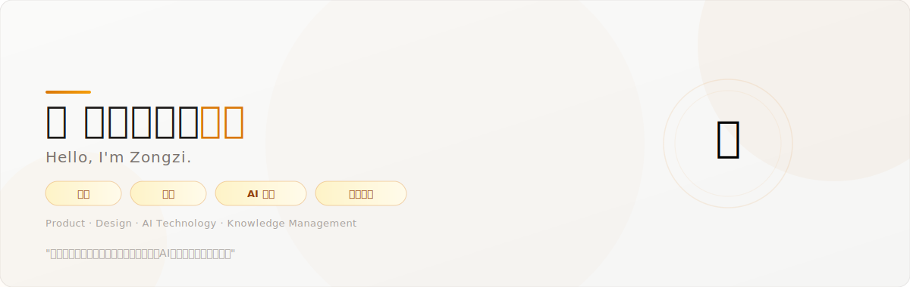

  

<!-- ## 🧭 我在做什么 -->

  

  <table>
    <tr>
      <td width="33%" align="center">
         
        <strong>📐 产品设计</strong> 
        Product Design 
         
        通过产品思维把抽象概念转化为 可落地的方案和系统
      </td>
      <td width="33%" align="center">
         
        <strong>🤖 AI 应用</strong> 
        AI Applications 
         
        研究 AI 能力边界与最佳实践， 转化为可复用的工作流 SOP
      </td>
      <td width="33%" align="center">
         
        <strong>📚 知识管理</strong> 
        Knowledge Management 
         
        构建个人知识管理体系： 信息输入 → 提炼结构 → 复利成长
      </td>
    </tr>
  </table>

 

<!-- ## 🧰 常用工具栈 -->

  

  
  
  
  
  
  
  
  
  

 

<!-- ## 📖 知识库资源 -->

  

  
  
  

 

<!-- ## 🛠 实用工具 -->

  

### 🔍 自定义搜索引擎

- **[Google 视频搜索](https://cse.google.com/cse?cx=27ae7a7385f8b45be)** — 自定义视频内容搜索引擎

### 📦 开源项目

- **[🌰 粽子书签工具](https://github.com/ZONGZI-000/Zongzi-Bookmark-Tools)** — Chrome 扩展：书签 WebDAV 同步 + AI 分类 + 摘要管理

 

<!-- ## 🤝 欢迎交流 -->

  

  <table>
    <tr>
      <td align="center">
         
        <strong>📧 Email</strong> 
         
        <a href="mailto:mr.zongzi666@gmail.com">mr.zongzi666@gmail.com</a>
      </td>
      <td align="center">
         
        <strong>💬 公众号</strong> 
         
        粽子上山指南针
      </td>
    </tr>
  </table>

 

<!-- ## 📊 GitHub 统计 -->

  

  
  

  
  

  如果内容对你有帮助，不妨点个 Star 支持一下 ☕

